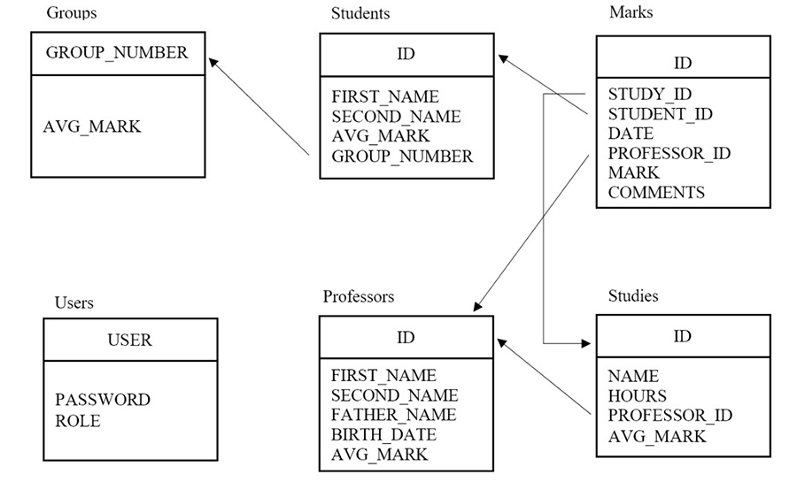

# Web application "Electronic student's handbook"

**Used technologies**: Java EE, Servlets, MySQL, DB2, JSP / JSTL, Bootstrap, CSS.

The goal of the application development is to provide access to the information about students and teachers, and to manage it.

**Requirements**:
1.	Authorization of users. 3 roles: Student, Teacher, Admin.
2.	Implement the following pages
-	Reading, editing (for admin) groups.
- Reading, editing (for admin) students.
- Reading, adding (for the administrator and teacher) marks.
- Reading, editing (for admin) teachers.
- Reading, editing (for admin) subjects.
- Reading (for admins), editing (for admin) users of the application.
3.	Implement a call of the stored procedure for recalculating average marks for groups, students, subjects, teachers.
4.	Implement a site navigation.

**Data model:**

[View screenshots](https://github.com/4kix/StudentHandbk/tree/master/img/screenshots)
